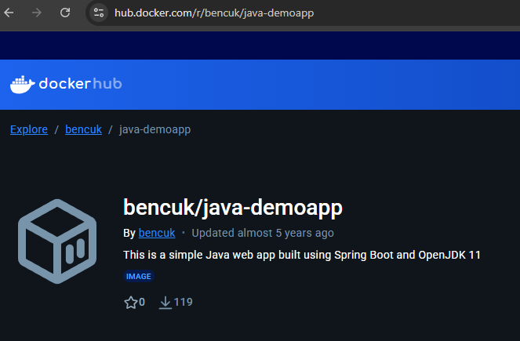
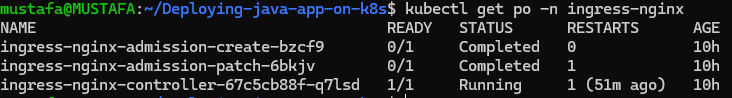

📌Presentation

🎯 Minikube Setup

For Minikube installation, we provide the installation with the necessary commands for Linux from the official website. https://minikube.sigs.k8s.io/docs/start
Here I installed it on a machine running Ubuntu on WSL.

"curl -LO https://github.com/kubernetes/minikube/releases/latest/download/minikube-linux-amd64"
"sudo install minikube-linux-amd64 /usr/local/bin/minikube && rm minikube-linux-amd64"

After the Minikube installation was completed, we used Docker as the container runtime tool.

"sudo apt install docker.io"

Then we started the cluster.

"minikube start"

🎯 Application Deployment

We used a java application for deployment. https://github.com/benc-uk/java-demoapp

To deploy the application, we pulled the image pushed to the dockerhub address and defined it for deployment.

🎯 Ingress Configuration

We activated the ingress configuration in minikube to provide access via a domain address.

"minikube addons enable ingress"

We created a self-signed SSL certificate for HTTPS. We used openssl for this.

"openssl req -x509 -nodes -days 365 -newkey rsa:2048 -keyout tls.key -out tls.crt -subj "/CN=java-demoapp.example.com/O=java-demoapp"

We created a Kubernetes secret to provide the generated key and crt from outside.

kubectl create secret tls java-demoapp-tls --cert=tls.crt --key=tls.key

After deploying the manifest files, we used a tunnel to access the domain.

"minikube tunnel"